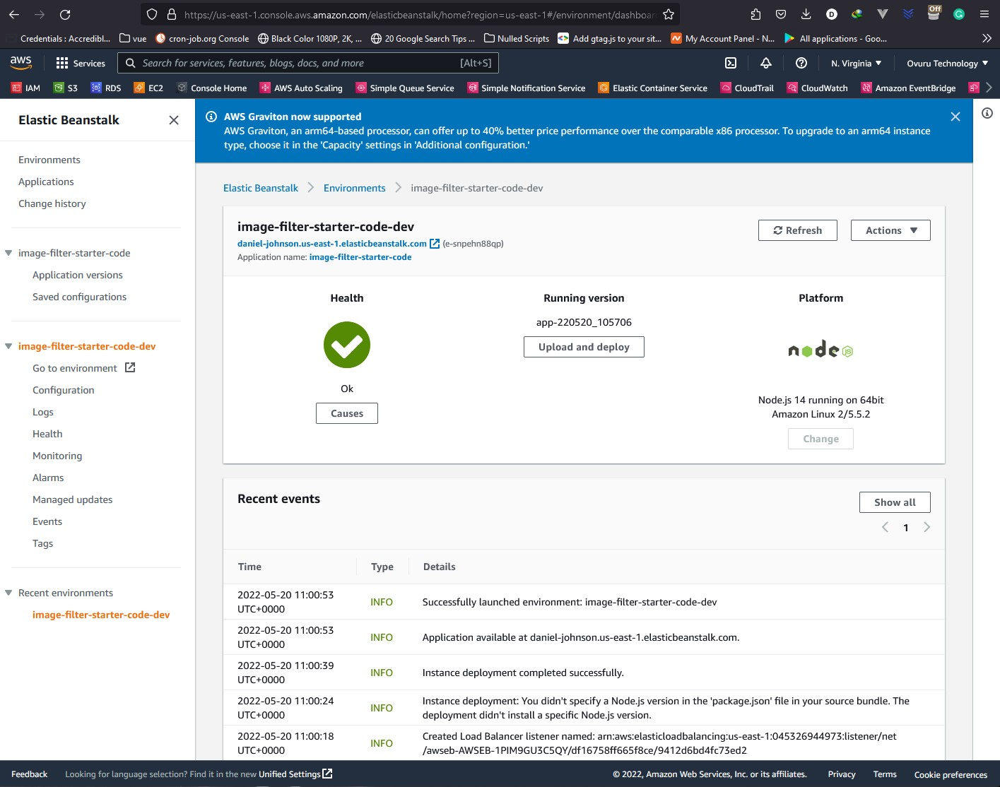

# Udagram Image Filtering Microservice Project Submission

This is a submission of my project: Udagram (My own Instgram on AWS). 
I encountered limitations with the provided account on AWS in regards to creating IAM user and IAM policy groups. So I decided to use my own personal account.

<!-- The project is runing at:
1. [AWS link](http://daniel-johnson.us-east-1.elasticbeanstalk.com/) this is the link provided by the EB deployment
2. [Custorm link](http://divat.store/), ``divat.store`` personal provission
3. [Custorm subdomain link](http://aws-eb.divat.store/), ``aws-eb.divat.store`` personal provission -->

### Setup Node Environment

You'll need to create a new node server. Open a new terminal within the project directory and run:

1. Initialize a new project: `npm i`
2. run the development server with `npm run dev`
3. to build for production  `npm run build`
> !!NOTE the build proccess is configured for windows environment. if you need to build for linux please run `npm run build-linux`

### Testing the server

1. Import the `daniel-johnson.postman_collection.json` to postman. 
> !!NOTE The endpoint `/filteredimage` is secured, which means you net a token to access the endpoint.

2. To generate a token, simply send a request to the endpoint Generate Token `/genToken?name={{Desired-Name}}` passing your desired name.

3. Copy the token response and add it to the authorization headers.

In order to test the server for error codes, try omitting the token/parameters in your request and see what happens.
